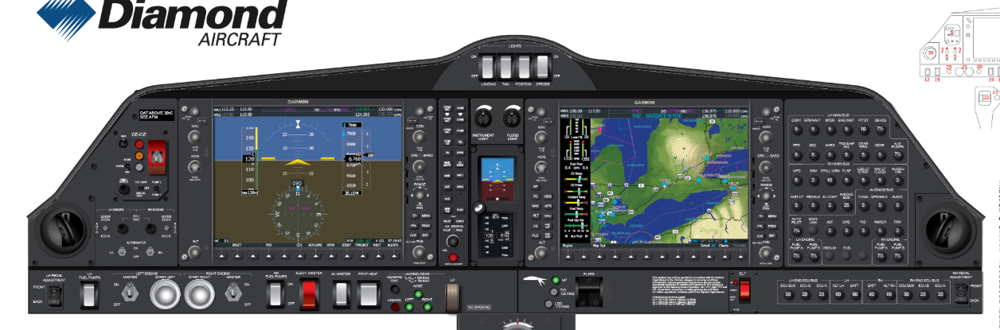

# Cockpit Design Reference — the Diamond glass panel

> **Graphical gold standard for the out-the-window view: Pilotwings (SNES).** Soft
> textured Mode-7 *terrain* seen from above (grass/water/roads/runways as painted
> surface), sprite-scaled trees + puffy clouds, a soft hazy horizon with distant
> rolling land. Clean, colourful, readable — NOT the hard F-Zero racing checker or
> roadside pylons. The renderer (`windshield.js`) aims at this look; the cockpit panel
> aims at the Diamond glass reference below.

> A visual/layout reference for the Architect flight cockpits. The **Mayfly** is the
> first target; the language here is meant to scale to every future aircraft cockpit.
> This is a *look-and-layout* guide, not an implementation spec — pair it with
> [Flight_Implementation.md](Flight_Implementation.md) and the as-built
> [docs/systems-flight.md](../systems-flight.md).
>
> **Status:** mostly shipped. The PFD (tapes · pitch ladder · VSI · slip ball), the MFD
> moving map, the engine/annunciator cluster, the flap detent lever and the panel/exterior
> light switches are all live in `cockpit.js` — see the mapping table at the bottom for
> what's left. Correctness of this doc = that table, not the prose specs.
>
> **Reference image:** 

## Why this reference

It's a clean, modern **glass-and-switch** light-aircraft panel: two big glass
displays doing the heavy lifting (attitude/tapes on the left, a moving map on the
right), wrapped in a dark composite panel studded with real switches, knobs, and
levers. That's exactly the target feel for Architect — *a believable machine you
operate*, readable at a glance, mechanical where it counts, without drifting into
sci-fi. We adopt the **anatomy and reading order**, then dress it in Architect's own
salvaged-cyberpunk / FM-synth identity (it should never look like a Garmin clone).

## Panel anatomy (what's in the reference)

Read left-to-right, the DA42 panel has five zones:

1. **PFD — Primary Flight Display (left glass).** The pilot's world:
   - **Airspeed tape** down the left edge — a vertical scrolling ribbon, current speed
     in a box at centre, colour arcs (white/green normal, yellow caution, red Vne), a
     cyan speed bug.
   - **Attitude indicator** centre — blue sky over brown ground, a roll scale arc with
     a pointer up top, a pitch ladder, and a fixed yellow aircraft-wings symbol.
   - **Altitude tape** down the right edge + a **selected-altitude bug** (cyan) and the
     **baro** setting (e.g. `30.15 IN`) beneath it.
   - **Vertical-speed indicator** just right of the altitude tape.
   - **HSI / heading** across the bottom — a compass rose, the heading in a box, a
     magenta course pointer.
   - **COM/NAV frequency** row across the top; **softkeys** across the bottom bezel.
2. **Centre stack.** Instrument/flood-light knobs; a small **engine display** (fuel
   flow, oil temp/pressure, volts/amps, fuel-quantity bars); the **radio/GPS control
   head** (COM/NAV knobs, an FMS keypad + big dual concentric knob, RANGE/MENU/FPL/PROC
   keys); the **master caution/warning** annunciators.
3. **MFD — Multi-Function Display (right glass).** A **moving map**: terrain topography
   (green lowlands, tan highlands, blue water), roads, waypoints, a range ring, the
   aircraft symbol, and a **vertical engine strip** down its left edge (RPM/MAP, fuel
   flow, oil, CHT/EGT, fuel qty, volts/amps as bar gauges).
4. **Electrical / breaker panel (far right).** Rows of labelled circuit breakers by bus
   (LH/RH ENG, MAIN, AVIONICS) — pure texture, "this thing has wiring."
5. **Sub-panel (bottom rail).** The physical controls: **engine start buttons** (round,
   metallic) + masters, fuel pumps, avionics master, pitot heat, a red **guarded**
   master switch, the **landing-gear selector** (UP/DN with green down-and-locked
   lamps), the **FLAPS lever** (UP · T-O · LDG detents), the **ELT**, bus voltages, and
   a wet **magnetic compass** at the very bottom. **Yoke columns** mount at the far left
   and right (the two round cut-outs).

## The design language to adopt

- **Layout = PFD (left) · systems/radio (centre) · MFD map (right) · controls (bottom
  rail).** Two glass panes framed by hardware. This is the skeleton for every Architect
  cockpit.
- **Materials.** Dark matte composite panel with soft bevels and subtle screw detail;
  glass displays sit slightly inset with a faint reflection. Switches/knobs read as
  real machined hardware (highlight top, shadow bottom).
- **Colour (map onto Architect's existing cyan avionics palette).**
  - Panel: near-black blue-grey (`#0b1219`-ish, our `--panel`).
  - Primary data / glass: **cyan** (`#8fd0ff`). Sky in the ADI cool blue, ground warm
    brown/olive.
  - **Magenta** for course/nav bugs, **green** for "armed/OK" lamps and selected values,
    **amber** for caution, **red** for warnings and **guarded** switches.
  - Silkscreen labels in dim white/grey, small mono caps with letter-spacing.
- **Typography.** Monospace, tabular numerals, tiny letter-spaced caps for labels — we
  already use this. Values large and glanceable; labels small and quiet.
- **Everything moves (the Feel doc).** Needles/tapes scroll and lag slightly, switches
  throw, lamps illuminate, the horizon banks — nothing snaps.

## PFD spec — the upgrade from our current readouts

The reference pushes us to a **proper PFD** (most of this is now built — see the
mapping table):
- Replace the digital IAS/ALT boxes with **vertical scrolling tapes** flanking the
  attitude indicator (airspeed left, altitude right), each with the current value
  boxed at centre and a coloured scale. Mark **Vr** on the airspeed tape (per the
  Flight doc — Rotate, not V1).
- Grow the **attitude indicator** into the hero instrument: roll arc + pointer at top,
  pitch ladder, fixed wings, sky/ground that banks and pitches (we have the core; make
  it bigger and add the roll scale + pitch ladder).
- Add a **VSI** beside the altitude tape and an **HSI/heading** strip along the bottom.
- Keep it driven by the same eased client-sim state we already push each frame.

## MFD spec — our map already fits here

The right-hand MFD is a **moving map** — and we just built exactly the content for it:
the **biome-rendered world** (`biomes.js` + the enriched map window). The MFD is where
the north-up/track-up nav map lives, heading-up, with the craft glyph, range rings, the
biome/terrain tiles, roads (artery), fields, and no-fly. The **engine strip** down its
edge = our fuel/RPM/temp gauges.

## Controls surround

Frame the glass with the hardware, styled as machined switches:
- A **top switch row** (lights: landing/taxi/strobe — flavour, but sells it).
- The **engine master** as a real switch/start (we already made the ENGINE switch — keep
  evolving it toward a round start button + guarded master).
- The **FLAPS lever** with detents (UP · T-O · LDG) instead of plain buttons.
- **Landing-gear selector** with green down-and-locked lamps *on retract-capable craft*.
- **Master caution/warning** annunciator that lights amber/red on hazards (stall,
  engine, bingo fuel) — replaces text warnings, matches the audio horn.
- The **yoke** anchored to the panel base (our drag pad, dressed as a yoke).

## Adapting to the Mayfly (simplify hard)

The Mayfly is a cheap single-engine ultralight trainer — so it's the **stripped subset**
of this panel, not the full twin:
- **One** engine strip, **one** start/master. No landing gear selector (fixed gear). No
  second COM/NAV. A minimal breaker cluster (or none).
- Still a real **PFD** (airspeed tape · attitude · altitude tape · VSI · HSI) and the
  **map MFD** — those are the identity and stay even on the cheapest airframe.
- Slightly cruder dressing than a pristine Diamond: this is salvaged kit — a little
  scuffed, a mismatched switch, an honest analog RPM needle next to the glass. That's
  the Architect flavour, and it visually distinguishes the ultralight tier.

## Scaling to future cockpits (the basis)

This ties into the **per-class adaptive layout** already in `cockpit.js` (`mountHud`
composes by capability + size). Use this reference as the "full" panel and add/remove
zones per class:
- **Heavy / freighter** → the full twin treatment: multiple engine strips, a denser
  breaker wall, weight-&-balance/cargo readout on the MFD, four-engine gauge cluster.
- **Gunship** → a weapons/targeting MFD page, armament annunciators, a harder military
  chrome (red accents), heads-down stores management.
- **Heli** → swap the yoke for **collective + cyclic**, add rotor-RPM/torque gauges and
  a hover/VSI tape; the map MFD stays.
- **Ultralight (Mayfly)** → the minimal subset above.
- **Wreck/Carcass** → the degraded panel (flicker, dead segments, "AVIONICS DEGRADED") —
  the reference panel with half its lights out.

Consistent skeleton, class-specific density and chrome — so a player who learns the
Mayfly can read a Leviathan.

## Mapping to what exists today

| Reference element | Have it? | Action |
|---|---|---|
| Attitude indicator | ✅ hero, ±30° pitch ladder (`paintPFD`) | add the roll scale arc + pointer |
| Airspeed/altitude | ✅ scrolling **tapes**, Vr/Vne/Vs0 marked (`pfdTape`) | — |
| VSI / HSI | ✅ VSI bar · ⚠️ heading is a digital box, not an HSI | add a compass-rose/HSI strip |
| Moving-map MFD | ✅ (`paintMFD`, biome map) | add the vertical engine strip down its edge |
| Engine gauges | ✅ per-engine dials + annunciator strip (`paintGauges`) | restyle as a vertical bar **strip** |
| Yoke / throttle / flaps | ✅ yoke · throttle · **flap detent lever** (UP/10°/20°/FULL, per class) · rudder pedals · trim | — |
| Engine start/master | ✅ (ENGINE switch) | evolve → round start + guarded master |
| Master caution/warning | ✅ annunciator tiles (stall · low-Nr · VRS · autorotation · bingo) | — |
| Switch rows / breakers | ⚠️ PANEL + LIGHTS switches | add the breaker texture |
| Landing-gear selector | ✅ up/down/fixed state per class (`gearRetract`) | add green down-and-locked lamps |
| Slip/skid ball | ✅ (not in the reference — ours) | — |
| Dark composite panel + bezels | ⚠️ | deepen the panel material + insets |

## The one rule

Borrow the **anatomy, reading order, and "operate a real machine" feel** — then make it
unmistakably **Architect**: salvaged, a little grimy, cyan FM-glass, cyberpunk rather
than corporate-Garmin. Readability first, always.
